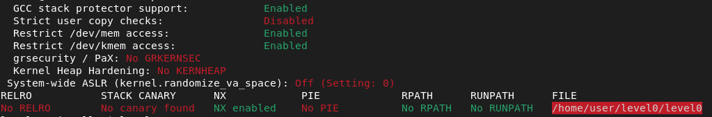

# **Level 0**

Pour commencer, parlons de la connection a la VM, lorsque l'on se connectes, des informations importantes sont affichees a l'ecran

> ### NEXT : [Level 1](/level1/resources/README.md)
